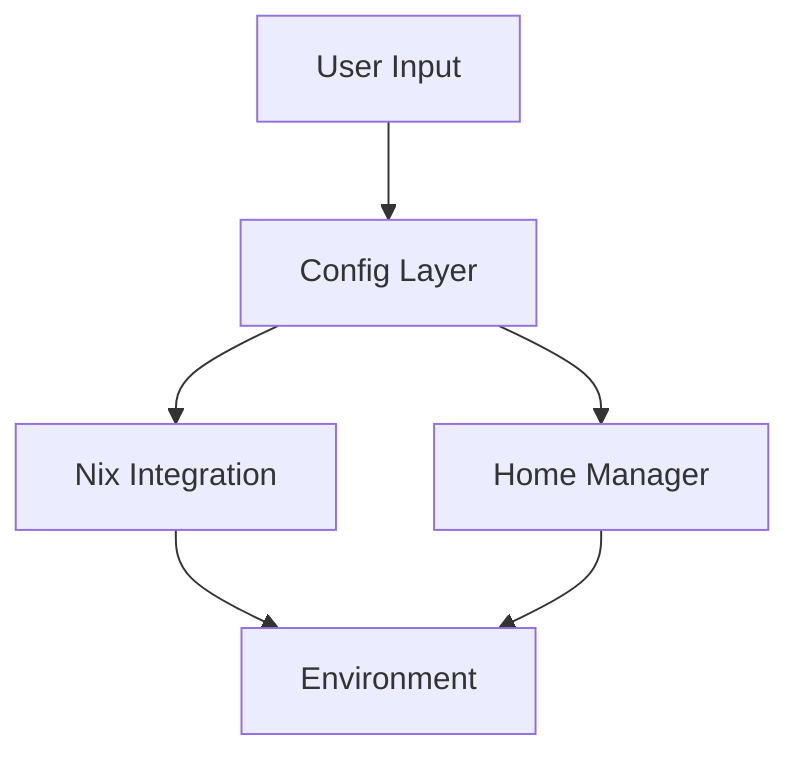

# Architecture Overview

## Quick Reference



## Core Components

```shell
nix-foundry/
├── cmd/          # CLI interface
├── internal/     # Core logic
│   ├── config/   # Configuration
│   ├── env/      # Environment
│   └── nix/      # Nix integration
└── pkg/          # Public APIs
```

## Key Features

### 1. Configuration Management
```yaml
# Layered configuration:
personal: ~/.config/nix-foundry/config.yaml
project: .nix-foundry.yaml
merged: Generated at runtime
```

### 2. Environment Handling
```bash
# Environment switching
nix-foundry switch personal
nix-foundry switch project

# State management
nix-foundry rollback
```

### 3. Integration Points
- Nix package manager
- Home-manager
- Project tools
- Shell environments

## Core Workflows

### Personal Setup
```shell
Config → Validation → Home-Manager → Environment
```

### Team Integration
```shell
Project Config → Merge → Validate → Apply
```

## Best Practices

See our comprehensive [Best Practices Guide](BEST-PRACTICES.md#architecture).

Need help? See:
- [Development Guide](DEVELOPMENT.md)
- [Contributing](CONTRIBUTING.md)
- [FAQ](FAQ.md)
