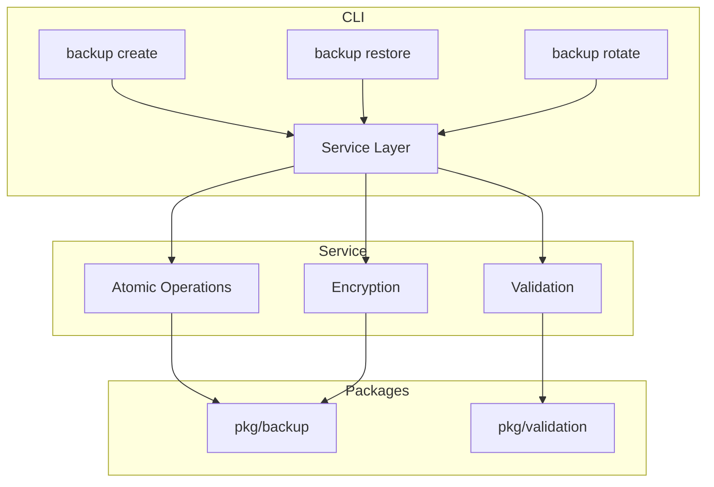
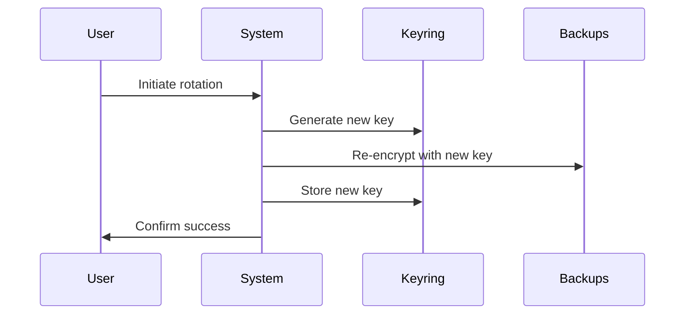
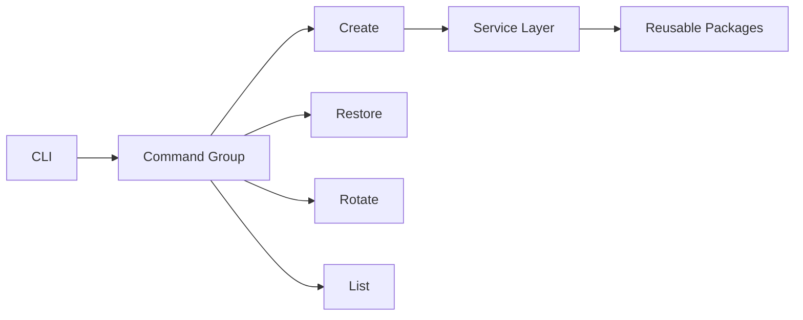
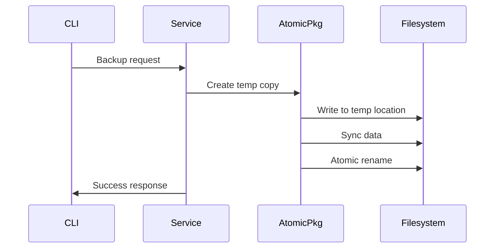

# Development Guide

First, install nix-foundry following the [installation guide](GETTING-STARTED.md#installation).

## Quick Setup

```bash
# Initialize with development packages
nix-foundry init --auto \
  --shell zsh \
  --editor nvim

# Add development tools
nix-foundry packages add \
  go \
  gopls \
  delve \
  golangci-lint
```

## Core Components

```go
nix-foundry/
├── cmd/          # CLI commands
├── internal/     # Core logic
├── pkg/          # Public APIs
└── test/         # Test suites
```

## Development Tasks

### Testing
```bash
# Run test suite
go test ./...

# Test specific component
go test ./internal/config/...

# Watch mode
go test -watch ./...
```

### Code Quality
```bash
# Format code
go fmt ./...

# Run linters
golangci-lint run

# Check all
go vet ./...
```

## Build Process

### Local Build
```bash
# Build binary
go build -o nix-foundry ./cmd/nix-foundry

# Install locally
go install ./cmd/nix-foundry
```

### Release Build
```bash
# Create release
git tag v1.2.3
git push origin v1.2.3

# Verify release
git checkout v1.2.3
go test ./...
```

## Best Practices

See our comprehensive [Best Practices Guide](BEST-PRACTICES.md#development).

Need help? See:
- [Contributing Guide](CONTRIBUTING.md)
- [FAQ](FAQ.md)
- Join [Discord](https://discord.gg/nix-foundry)

## Security Practices

```bash
# Generate encryption key
nix-foundry config generate-key

# Backup with encryption
nix-foundry backup create --encrypt
```

### Permission Requirements
```bash
# Verify directory permissions
find ~/.config/nix-foundry -type d -exec stat -c "%a %n" {} \; | grep -v 700
```

## Observability

```bash
# View metrics
nix-foundry metrics show

# Export metrics
nix-foundry metrics export --format=json
```

## Atomic Operations

```go
// Atomic restore sequence
1. Create temp directory
2. Validate backup contents
3. Swap current environment
4. Verify restored state
5. Cleanup old versions
```

## Backup System Architecture



## Encryption Key Lifecycle
```go
1. Key Generation --> 2. Secure Storage --> 3. Usage --> 4. Rotation
```

## Disaster Recovery

```bash
# 1. Restore latest backup
nix-foundry backup restore latest

# 2. Reinitialize core components
nix-foundry init --recover

# 3. Verify environment
nix-foundry doctor --full
```

## Key Rotation Process


## Backup Command Structure



## Atomic Operation Guarantees


